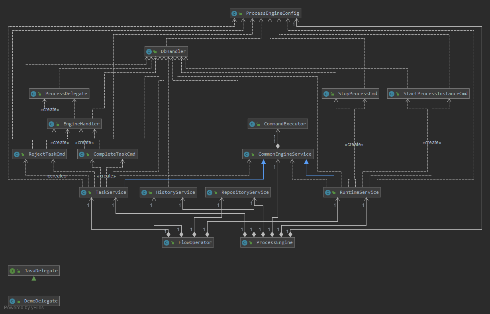

# IFlow 流程引擎组件

# overview
`iflow`是遵循BPMN 2.0的标准，参考flowable 6.6的api又简化其设计的轻量级业务流程引擎。

> 业务流程模型注解（Business Process Modeling Notation - BPMN）是 业务流程模型的一种标准图形注解。这个标准 是由对象管理组（Object Management Group - OMG）维护的。http://www.mossle.com/docs/jbpm4devguide/html/bpmn2.html

> Flowable是一个用Java编写的轻量级业务流程引擎。Flowable流程引擎允许您部署BPMN2.0流程定义(BPMN是一种用于定义流程的XML行业标准)、创建这些流程定义的流程实例、运行查询、访问活动或历史流程实例和相关数据，以及更多其他功能

# 组件中单词的简写
- process -> proc
- instance -> inst
- define -> def

# 实体关系图

- ProcessDefine 流程定义类，只包含流程基本信息。

- ProcessNode 流程节点定义类，以双向链表的结构定义流程节点。一个流程必须包含开始节点和结束节点。开始节点的标识是`preProcNodeId == -1`,结束节点的标识是`nextProcNodeId == -1`

- ProcessInstance 流程实例类，一个和业务相关联的具体流程定义为ProcessInstance，会记录当前流程节点id

- Execution 流程运行时执行类，类流程运行时的具体数据，相当于具体流程运行时的指针

- Task 任务类，指需要人工处理的任务，包括处理人标识

- ProcessHistory 流程历史记录类，流程流转过程中，将已经过的流程节点信息保存至历史记录中。

# 类图 

主要类说明

-  ProcessEngine 是流程引擎核心类，包含流程引擎配置和流程引擎的服务：`CommonEngineService` `RepositoryService` `RuntimeService` `TaskService` `HistoryService`.
其中`CommonEngineService`是其他服务的父类。

- RepositoryService 是流程静态资源管理类，负责流程定义。

- RuntimeService 是流程运行时管理类，负责产生`ProcessInstance` `Execution` `Task`，流程开始和强制终止

- TaskService 是流程运行时任务管理类，负责通过任务和驳回任务

- HistoryService 是流程历史记录管理类，负责查看记录记录（保存记录）;

- FlowOperator 是将流程操作封装，隐藏细节，供外部方便调用的流程操作类。

